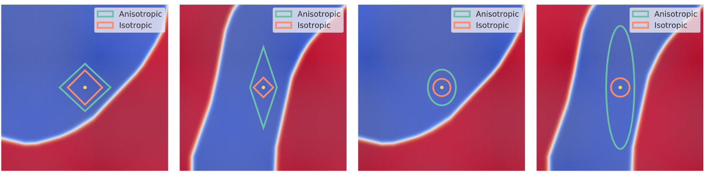

This is the official code for the work titled:

# ANCER: Anisotropic Certification via Sample-wise Volume Maximization

prerprint: 




### Setting up

To reproduce our results, first you need to install a [Conda](https://www.anaconda.com/) environment with the right dependencies. You can do so by running the following line from the main directory:

```
conda env create -f ancer.yml
```

Then, activate our environment by running:

```
conda activate ancer
```

Now, you are ready to reproduce our results. 

### Running experiments

Note that ANCER requires a trained model and the corresponding isotropic sigmas produced with the code from ["Data Dependent Randomized Smoothing" (link to repository)](https://github.com/MotasemAlfarra/Data_Dependent_Randomized_Smoothing).

Here is a link to pretrained models:

Here is a link to isotropic sigmas:

To run ANCER's optimization, create a destination folder for the optimized sigmas by running:

```
mkdir anisotropic_sigmas_for_cohen
```

followed by the command:

```
python ancer.py --norm l2 \
--model ${PATH_TO_PRETRAINED_MODEL} \
--isotropic-file ${PATH_TO_ISOTROPIC_SIGMA} \
--model-type resnet18 --dataset cifar10 \
--output-folder anisotropic_sigmas_for_cohen
```
where  `--model-type` coule be either `resnet18` or `wideresnet40` for CIFAR10 or  `resnet50` for ImageNet. 
Note that this will run ANCER's optimization with the default hyperparameters detailed in our appendix for a the pretrained model with the isotropic sigmas as initialization. The output of this code will be a set of sigmas saved in `output-folder` for CIFAR-10 testset.

Next, you need to certify the same model with the obtained anisotropic smoothing parameters. This requires running the following command:

```
python certify.py --norm l2 \
--sigma 0.12 \
--method ancer \
--outfile results.txt \
--model-type resnet18 --dataset cifar10 \
--model ${PATH_TO_PRETRAINED_MODEL} \
--optimized-sigmas anisotropic_sigmas_for_cohen
```

The output of this is a .txt file that is formatted as:

```
"idx    label   predict    radius   radius_proxy    correct    min_sigma   time"
```

where:

- `idx`: index of the instance in the test set.
- `label`: ground truth label for that instance.
- `predict`: predicted label for that instance.
- `radius`: the l2 isotropic radius of that instance.
- `radius_proxy`: the radius proxy for that instance.
- `correct`: a flag that shows whether the instance is correctly classified or not.
- `min_sigma`: the minimum sigma of that instance.
- `time`: time required to run `Smooth.certify` on that instance (excluding optimization time).

To compute the certified accuracy at a given radius R, you need to count the number of instances that are classified correctly (correct flag is 1), and has a radius/`radius_proxy` that is at least R.
