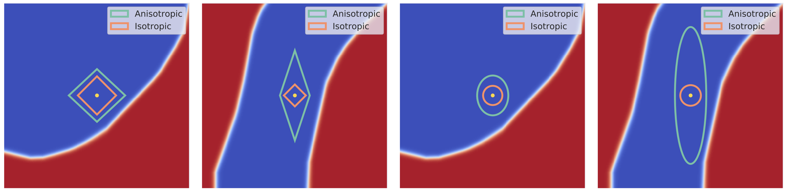

# ANCER: Anisotropic Certification via Sample-wise Volume Maximization



This repository contains the source code for the [ANCER Python package](https://pypi.org/project/ancer-python/), as well as scripts that allow one to reproduce the results from the paper [*"ANCER: Anisotropic Certification via Sample-wise Volume Maximization"*](https://openreview.net/pdf?id=7j0GI6tPYi). This work was accepted to the Transactions on Machine Learning Research (TMLR). If you use it, please cite it appropriately as:

```
@article{
eiras2022ancer,
title={{ANCER}: Anisotropic Certification via Sample-wise Volume Maximization},
author={Francisco Eiras and Motasem Alfarra and Philip Torr and M. Pawan Kumar and Puneet K. Dokania and Bernard Ghanem and Adel Bibi},
journal={Transactions of Machine Learning Research},
year={2022},
url={https://openreview.net/forum?id=7j0GI6tPYi},
note={}
}
```
This repository is licensed under the terms of the MIT license.

## Installing the package

The ANCER package requires `python>=3.7`, and can be installed through `pip` as:

```
pip install ancer-python
```

## Package contents

This package requires and extends the optimization framework presented in ["Data Dependent Randomized Smoothing" (link to repository)](https://github.com/MotasemAlfarra/Data_Dependent_Randomized_Smoothing), and as such uses the same base classes and structure. 

In particular it contains an instance-wise optimization function, `optimize_ancer` that can be run on a batch of inputs, as well as a class `OptimizeANCERSmoothingParameters` which can be used to run this process for a given dataset and save the results to file. Examples of usage of the dataset optimization class can be found within the `scripts` folder.

## Reproducing experiments

The code to reproduce the experiments presented in the paper is available within the `scripts` folder, which is divided into (i) a training folder for the l1 baselines, (ii) a console script to run the optimization of a dataset in `run_optimization_dataset.py` and (iii) a console script to certify a dataset with fixed or data-dependent thetas in `certify_dataset.py`. To use it, clone this repo into your local machine. Pre-trained models used in the results can be found [here](https://drive.google.com/drive/folders/1t4IGRDmQ_qA8UVhkJYa3RWXFM6v-5vm5?usp=sharing).

To run ANCER's optimization, simply navigate to the `scripts` folder and run `run_optimization_dataset.py` (run `python run_optimization_dataset.py --help` for help with the arguments). The output of this code will be a set of thetas saved in an output folder.

Next, you can certify the same model with the obtained anisotropic smoothing parameters by running the `certify_dataset.py` script (run `python certify_dataset.py --help` for help with the arguments). The output of this process is a CSV file with the following header:

```
"idx    label   predict    radius   radius_proxy    correct    min_sigma   time"
```

where:

- `idx`: index of the instance in the test set.
- `label`: ground truth label for that instance.
- `predict`: predicted label for that instance.
- `radius`: the l2 isotropic radius of that instance.
- `radius_proxy`: the radius proxy for that instance.
- `correct`: a flag that shows whether the instance is correctly classified or not.
- `min_sigma`: the minimum sigma of that instance.
- `time`: time required to run `Smooth.certify` on that instance (excluding optimization time).

To compute the certified accuracy at a given radius R, you need to count the number of instances that are classified correctly (correct flag is 1), and has a radius/`radius_proxy` that is at least R.
